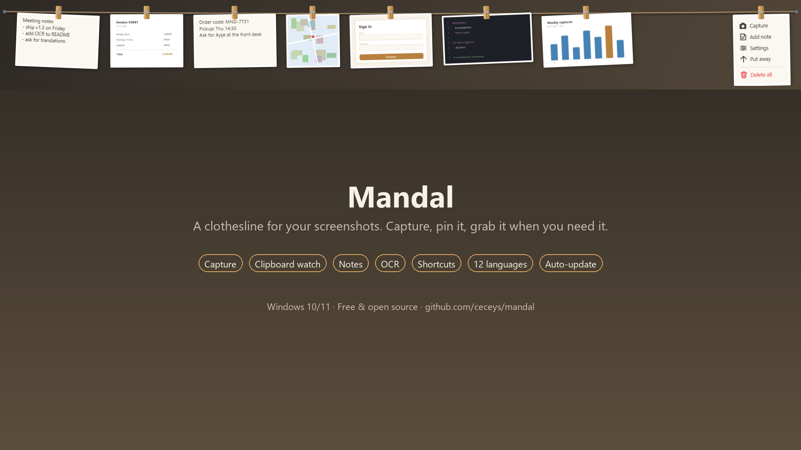
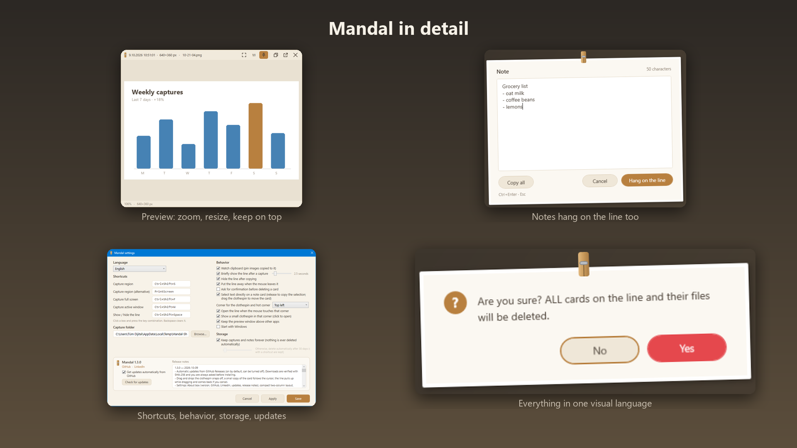

<p align="center">
  
</p>

<h1 align="center">Mandal</h1>

<p align="center">A clothesline for your screenshots. Capture, pin it on the line, grab it when you need it.</p>

<p align="center"><a href="README.tr.md">Türkçe</a></p>

<p align="center">
  <a href="https://github.com/ceceys/mandal/releases/latest/download/Mandal-Setup.exe"></a>
</p>

<p align="center">One click installer, no admin rights needed · <a href="https://github.com/ceceys/mandal/releases/latest/download/Mandal.exe">Portable exe</a> · <a href="https://github.com/ceceys/mandal/releases/latest">All files</a></p>



**Mandal** (Turkish for *clothespin*) is a small Windows tool. Every capture is pinned to a clothesline at the top of the screen. The line stays out of the way until you call it; then you click a card to copy it, drag it into another app, or take it down with the ✕.

## Features

- **Capture** a region (`Ctrl+Shift+S` or `PrtScn`), the full screen (`Ctrl+Shift+F`) or the active window (`Ctrl+Shift+W`).
- **Clipboard watching**: any image copied by another tool (e.g. `Win+Shift+S`) is pinned too.
- **One click copies** the card to the clipboard (image + file), **drag and drop** works into Explorer, Word, browsers, chat apps.
- **Preview**: double-click a card to open it large at the top of the screen. Resize from the edges, zoom with the wheel, keep it above other apps with the pin button.
- **Convert an image to text** with the `Aa` button (Windows built-in OCR, offline). The text becomes its own card.
- **Notes**: write a note from the right-hand card; it hangs on the line like a capture. Open it large, select a part and release to copy only that, or copy all.
- **Per-item shortcuts**: assign e.g. `Ctrl+Alt+1` to a card; pressing it copies that card, even after a restart.
- **Stretching line**: cards shrink as you pin more (12 → 16 → 24 → 32 → 40 → 50 → 60 per screen); beyond that, slide with the arrows or the mouse wheel.
- **Persistent**: captures are stored as PNG/TXT in day folders and come back after a restart.
- **12 languages**: Türkçe, English, Deutsch, Français, Español, Italiano, Português, Русский, العربية, 中文, 日本語, 한국어.
- **Auto-update** from GitHub Releases, verified with SHA-256 and always confirmed before installing (can be turned off).
- **Private**: no telemetry; the update check is the only network access. See [docs/SECURITY.md](docs/SECURITY.md).



## Install

1. **[Download Mandal-Setup.exe](https://github.com/ceceys/mandal/releases/latest/download/Mandal-Setup.exe)** and run it. It installs for your user only, needs no admin rights and includes the .NET runtime.
2. If Windows shows *Windows protected your PC*, click **More info → Run anyway**. The file is not code-signed, so this warning is expected.

Portable alternative: [Mandal.exe](https://github.com/ceceys/mandal/releases/latest/download/Mandal.exe), a single file that needs the [.NET 8 Desktop Runtime](https://dotnet.microsoft.com/download/dotnet/8.0). All versions and release notes are on the [Releases](https://github.com/ceceys/mandal/releases) page.

Windows 10 version 2004 or newer. Mandal updates itself from GitHub Releases.

## Using the line

| Action | How |
|---|---|
| Show / hide the line | `Ctrl+Shift+Space`, the tray icon, the small tab at the top-left corner, or move the mouse into the top-left corner |
| Copy a card | Click it |
| Move a card into another app | Drag it |
| Preview large | Double-click the card, or hover and click the magnifier |
| Image → text | Hover the card, click `Aa` |
| Delete | Hover the card, click ✕ |
| Open, save as, show in folder, assign shortcut | Right-click the card |
| Capture / Settings / Put away | Buttons on the fixed card at the right end |

All shortcuts can be changed in **Settings** (tray menu or the right-end card).

## Build

Requires the .NET 8 SDK.

```
dotnet build -c Release
dotnet publish -c Release -r win-x64 --self-contained false -p:PublishSingleFile=true -o publish
```

Installer (needs [Inno Setup 6](https://jrsoftware.org/isinfo.php)):

```
dotnet publish -c Release -r win-x64 --self-contained true -p:PublishSingleFile=false -o publish-setup
iscc /DAppVersion=1.3.0 setup\Mandal.iss
```

## Files

- Captures: `%APPDATA%\Mandal\Clips\yyyy-MM-dd\` (changeable in Settings)
- Settings, item shortcuts, log: `%APPDATA%\Mandal\`

## Feedback and contributing

Bug reports, ideas and translation fixes are welcome. Open an [issue](https://github.com/ceceys/mandal/issues/new/choose) or see [CONTRIBUTING.md](CONTRIBUTING.md).

## License

[MIT](LICENSE)
