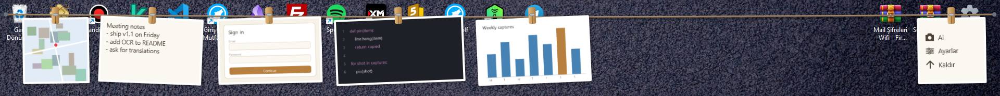

<p align="center">
  
</p>

<h1 align="center">Mandal</h1>

<p align="center">Ekran alıntıların için bir çamaşır ipi. Al, ipe as, lazım olunca ordan al.</p>

<p align="center"><a href="README.md">English</a></p>



**Mandal**, küçük bir Windows aracı. Her alıntı ekranın üstündeki çamaşır ipine mandalla asılır. İp sen çağırana kadar görünmez; çağırınca bir karta tıklayıp kopyalarsın, başka uygulamaya sürüklersin ya da ✕ ile indirirsin.

## Özellikler

- **Alıntı al**: bölge (`Ctrl+Shift+S` veya `PrtScn`), tam ekran (`Ctrl+Shift+F`), aktif pencere (`Ctrl+Shift+W`).
- **Pano izleme**: başka bir araçla (ör. `Win+Shift+S`) kopyalanan görüntüler de asılır.
- **Tek tık kopyalar** (görüntü + dosya); **sürükle-bırak** Explorer, Word, tarayıcı ve sohbet uygulamalarında çalışır.
- **Görseli metne çevir**: `Aa` düğmesi (Windows'un yerleşik OCR'ı, çevrimdışı). Metin kendi kartı olur.
- **Öğeye kısayol**: bir karta ör. `Ctrl+Alt+1` ata; basınca o kart kopyalanır, bilgisayar yeniden açılsa da.
- **Uzayan ip**: öğe arttıkça kartlar küçülür (ekran başına 12 → 16 → 24 → 32 → 40 → 50 → 60); fazlası oklarla veya tekerlekle kaydırılır.
- **Kalıcı**: alıntılar gün klasörlerinde PNG/TXT olarak durur, yeniden açılışta geri gelir.
- **12 dil**: Türkçe, English, Deutsch, Français, Español, Italiano, Português, Русский, العربية, 中文, 日本語, 한국어.
- **Gizli**: ağ yok, telemetri yok. Bkz. [docs/SECURITY.md](docs/SECURITY.md).

## Kurulum

[Releases](../../releases) sayfasından indir:

- `Mandal-Setup-x.y.z.exe` — kurulum paketi (kullanıcı bazlı, yönetici hakkı gerekmez, .NET çalışma zamanı içinde).
- `Mandal.exe` — taşınabilir tek dosya; [.NET 8 Desktop Runtime](https://dotnet.microsoft.com/download/dotnet/8.0) gerekir.

Windows 10 sürüm 2004 veya üstü. Dosya kod imzalı olmadığı için SmartScreen ilk çalıştırmada uyarabilir; *Daha fazla bilgi → Yine de çalıştır* seç.

## İpi kullanmak

| İşlem | Nasıl |
|---|---|
| İpi göster / gizle | `Ctrl+Shift+Space`, tepsi simgesi, sol üst köşedeki küçük sekme ya da fareyi sol üst köşeye götürmek |
| Kartı kopyala | Tıkla |
| Kartı başka uygulamaya taşı | Sürükle |
| Görsel → metin | Kartın üzerine gel, `Aa`'ya tıkla |
| Sil | Kartın üzerine gel, ✕'e tıkla |
| Aç, farklı kaydet, klasörde göster, kısayol ata | Karta sağ tık |
| Al / Ayarlar / Kaldır | Sağ uçtaki sabit karttaki düğmeler |

Tüm kısayollar **Ayarlar**'dan (tepsi menüsü veya sağ uçtaki kart) değiştirilebilir.

## Derleme

.NET 8 SDK gerekir.

```
dotnet build -c Release
dotnet publish -c Release -r win-x64 --self-contained false -p:PublishSingleFile=true -o publish
```

Kurulum paketi ([Inno Setup 6](https://jrsoftware.org/isinfo.php) gerekir):

```
dotnet publish -c Release -r win-x64 --self-contained true -p:PublishSingleFile=false -o publish-setup
iscc /DAppVersion=1.1.0 setup\Mandal.iss
```

## Dosyalar

- Alıntılar: `%APPDATA%\Mandal\Clips\yyyy-MM-dd\` (Ayarlar'dan değiştirilebilir)
- Ayarlar, öğe kısayolları, günlük: `%APPDATA%\Mandal\`

## Lisans

[MIT](LICENSE)
